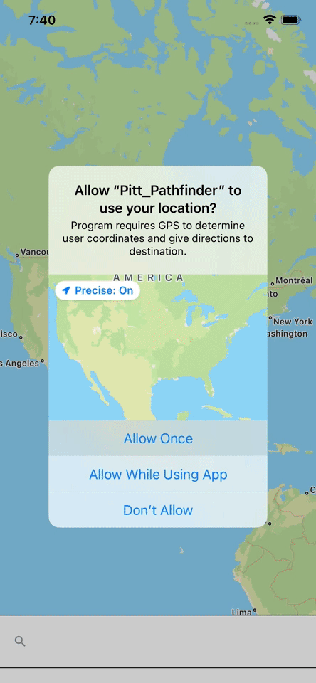

# Pitt Pathfinder App


Pitt Pathfinder is a navigation app build for IOS using React Native. The app gives directions from the users current location to any target destination.

## For Non-Developers 🚫🔧

This part of the README file is targeted towards those with less programming experience, especially in React Native. Rather than going over how the app works, this sections describes how to use the app. You can scroll down to the <i>For Developers</i> section if you want a more complicated, but in-depth rundown.

### Installation

Because Pitt Pathfinder is not an offically published app, it cannot be downloaded from the App Store. You can still install the app using the official source code in the Github repository, however, installation is rather advanced. If you aren't an experienced developer, it is recommended that you watch the demo videos provided in this section instead. If you still wish to install the app onto a simulator or a physical IOS device, you can go to the <i>Installation For Developers</i> section for instructions.

### Usage

Pitt Pathfinder is a navigation app like Google Maps, Apple Maps, and Waze. The primary goal of this app is to help the user get to their target destination. The app plots the route from the user's current location to their desired location. The app starts by asking for permission to enable location. If the user decides to deny access, then Pitt Pathfinder will not work correctly. Also note that IOS will only ask the user for permission once. Once an option is selected for the first time, this selection can only be changed in Settings.

</br>



</br>

Once you have your location enabled in the app, you can begin searching for target destinations. Start by clicking on the search bar. The search bar has autocomplete enabled, so you don't have to know the exact address of your destination. Once you have found your chosen destination in the menu, you can click on it to set your destination. A colored path should appear on the map, guiding you to your target destination. There's no need to scroll the map manually, the map will scroll by itself as you move!

</br>


</br>

Pitt Pathfinder is designed to be simple and straightforward. Controls are intuitive and easy for any user to grasp.

## For Developers 🔧

This part of the README file is targeted towards professional developers and those with more programming experience. This section goes over how the app was built, the technologies used, and possible future improvements. You can go to the <i>For Non-Developers</i> section for more information on how to use the app and to view short demo videos.

### Installation

This guide assumes prior developer experience, particually in React Native. The following technologies are used during development:

- npm == 8.1.0
- react-native == 6.3.1
- CocoaPods == 1.11.2

#### Download Code

The first step is to download the codebase from Github. All the code will be stored in the directory named <i>Pitt_Pathfinder</i>. Once the code is downloaded, you should set your current working directory to the directory containing the React Native code.

```
    git clone https://github.com/jweir136/Pitt-Pathfinder.git
    cd Pitt_Pathfinder/Pitt_Pathfinder
```

#### Install Dependencies

The second step is to install all the dependencies that are used by this project. CocoaPods is used for the installation.

```
    cd ios && pod install && cd ..
```

Once you have installed all the code and dependencies, the project is ready to go. From there you can just build and run the program in your simulator or device or choice.